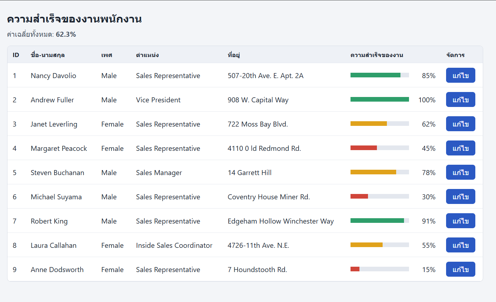
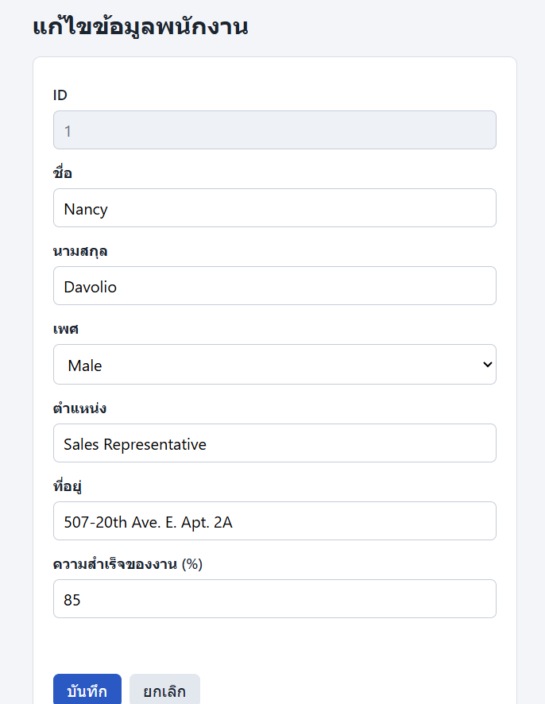

# ข้อ 1 · ตารางพนักงาน + กราฟความสำเร็จของงาน + แก้ไขข้อมูล

> โจทย์นี้เขียนขึ้นใหม่จากความจำของรุ่นพี่ ไม่ใช่โจทย์ต้นฉบับทุกคำ
> ส่วนที่มี **(เดาเติม)** คือรายละเอียดที่จำไม่ได้แน่ชัด ใส่ไว้ให้โจทย์ครบเพื่อฝึกทำ

## กติกาของข้อสอบชุดนี้

- **ห้ามก๊อปข้อมูลจากไฟล์ JSON มาพิมพ์ไว้ในโค้ด** ทุกอย่างที่แสดงบนหน้าเว็บต้องอ่านจากไฟล์ตอนรันเท่านั้น

ไฟล์ข้อมูล `db.json` แปะไว้ท้ายหน้านี้แล้ว

## สิ่งที่ต้องทำ

### ส่วนที่ 1: หน้าตาราง (`index.html`)

1. แสดงข้อมูลพนักงานทุกคนจากไฟล์เป็นตาราง
2. ตารางต้องมีคอลัมน์ ID, ชื่อ-นามสกุล, เพศ, ตำแหน่ง, ที่อยู่, ความสำเร็จของงาน, จัดการ
3. คอลัมน์ **ความสำเร็จของงาน** ต้องเป็น **แถบกราฟ** ที่ยาวตามค่า `Progress` และมีตัวเลข % กำกับ
4. ทุกแถวต้องมีปุ่ม **แก้ไข**
5. แสดงค่าเฉลี่ย Progress ของพนักงานทั้งหมดไว้เหนือตาราง

### ส่วนที่ 2: หน้าแก้ไข (`edit.html`)

6.Freestyle ก่อนกลางภาค ก็ลองทำ CRUD

)

## เกณฑ์ให้คะแนน (เดาเติม, รวม 10 คะแนน)

| รายการ | คะแนน |
|---|---|
| ดึงข้อมูลแสดงตารางครบทุกคอลัมน์ | 2 |
| แถบกราฟ Progress ยาวตามค่าและมีตัวเลข | 2 |
| ปุ่มแก้ไขส่ง id ไปหน้าฟอร์มถูกแถว | 1 |
| ฟอร์มแสดงข้อมูลเดิมครบ | 2 |
| บันทึกแล้วตารางเปลี่ยนตาม | 2 |
| ตรวจค่า Progress 0–100 | 1 |
| ********มั่วขึ้นมา เเตะคะเเนนมีเเบ่งเป็นย่อยๆ *******|

## เฉลย

กดปุ่ม **ดูเฉลย** มุมขวาบน 
