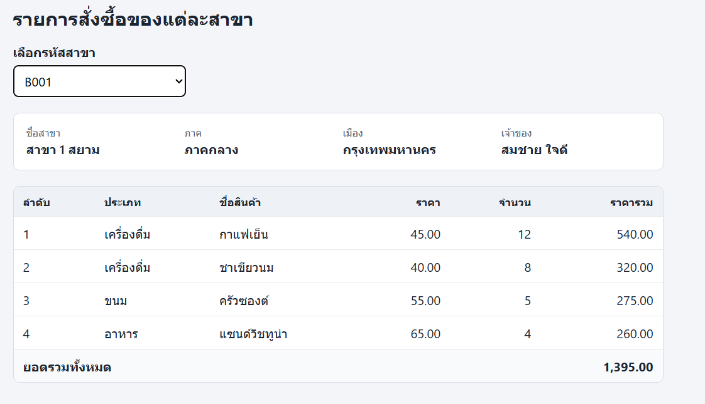

# ข้อ 2 · เลือกสาขาจาก dropdown แล้วแสดงรายการสินค้าด้วย DOM

> โจทย์นี้เขียนขึ้นใหม่จากความจำของรุ่นพี่ ไม่ใช่โจทย์ต้นฉบับทุกคำ
> ส่วนที่มี **(เดาเติม)** คือรายละเอียดที่จำไม่ได้แน่ชัด รวมถึงข้อมูลใน JSON ทั้งหมด (จำได้แค่โครงสร้าง)

## กติกาของข้อสอบชุดนี้

- **ห้ามก๊อปข้อมูลจากไฟล์ JSON มาพิมพ์ไว้ในโค้ด** ห้ามพิมพ์ `<option>` เอง **ลองมาเเล้วรู้สึกคะเเนนหาย**

ไฟล์ข้อมูล `branches.json` แปะไว้ท้ายหน้านี้แล้ว เป็น object ที่ข้างในมีข้อมูลซ้อนกัน 2 ชั้น คือ `branches` แต่ละสาขามี `items` ของตัวเอง

## สิ่งที่ต้องทำ

1. อ่านข้อมูลจากไฟล์ `branches.json`
2. สร้าง **dropdown** (`<select>`) ที่มีตัวเลือกเป็นรหัสสาขาครบทุกสาขาในไฟล์
3. **(เดาเติม)** ตัวเลือกแรกเป็น `-- เลือกสาขา --` และยังไม่แสดงตารางจนกว่าจะเลือกสาขา
4. เมื่อเลือกสาขา ต้องแสดงข้อมูลของสาขานั้น: ชื่อสาขา, ภาค, เมือง, เจ้าของ
5. แสดงรายการสินค้าของสาขานั้นเป็น **ตาราง** มีคอลัมน์ ลำดับ, ประเภท, ชื่อสินค้า, ราคา, จำนวน, ราคารวม
6. ราคารวมของแต่ละแถวต้องคำนวณจากราคาคูณจำนวน
7. **(เดาเติม)** แถวสุดท้ายต้องแสดงยอดรวมทั้งหมดของสาขานั้น
8. **(เดาเติม)** ตัวเลขเงินต้องมีคอมมาและทศนิยม 2 ตำแหน่ง เช่น `1,234.00`
9. **ต้องสร้างทุก element ด้วยวิธี DOM** คือ `document.createElement`, `textContent`, `appendChild` **ห้ามใช้ `innerHTML` ประกอบ string เป็นแท็ก**
10. เปลี่ยนสาขาแล้วตารางต้องเปลี่ยนตาม ห้ามมีแถวของสาขาเดิมค้างอยู่

## เกณฑ์ให้คะแนน (เดาเติม, รวม 10 คะแนน)

| รายการ | คะแนน |
|---|---|
| อ่าน JSON และสร้าง option จากรหัสสาขาได้ครบ | 2 |
| แสดงข้อมูลสาขา (ชื่อ ภาค เมือง เจ้าของ) ถูกต้อง | 2 |
| ตารางสินค้าครบทุกคอลัมน์ | 2 |
| คำนวณราคารวมของแต่ละแถวถูก | 1 |
| ยอดรวมทั้งหมดถูก | 1 |
| ใช้ DOM สร้าง element จริง ไม่ใช้ `innerHTML` | 1 |
| เปลี่ยนสาขาแล้วตารางเก่าหายหมด | 1 |
| มีเเบ่งคะเเนนจริงเเต่ตรงนี้มั่วขึ้นมา |
## เฉลย

กดปุ่ม **ดูเฉลย** มุมขวาบน หรือเปิด `solution/index.html` ด้วย Live Server
